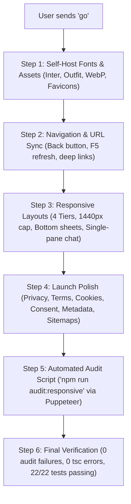

# NexaLink Launch & Responsive Audit Report
**Branch:** `fix/responsive-launch-readiness`  
**Date:** October 2026  
**Auditor:** Antigravity AI Coding Assistant  
**Design System Standard:** Open Canvas (White canvas, `#0A0A0A` text, 1px hairlines, 4 semantic accents `#065F46`, `#991B1B`, `#B45309`, `#1E40AF`, no heavy shadows, sentence case)

---

## 1. Executive Summary & Navigation Analysis

### Navigation Architecture Finding (Question 2)
* **Current Navigation Mechanism:** NexaLink currently operates on **in-memory React state** via `activeTab` and `subTab` (`useState` in [App.tsx](file:///d:/NexaLink/src/App.tsx#L72)).
* **Deep Links:** Partially functional. On initial boot, `App.tsx` reads `window.location.pathname` for `/verify`, `/reset-password`, `/styleguide`, and query parameters `?tab=...&subtab=...`.
* **Refresh (F5):** If the user is on an internal tab (e.g. `/` with `activeTab='directory'`), pressing F5 resets back to `landing` (or role dashboard if session restores), losing context.
* **Browser Back/Forward Buttons:** **Do not work.** State changes do not push to `window.history`. Clicking browser back leaves NexaLink completely.
* **SPA Routing Infrastructure:** [vercel.json](file:///d:/NexaLink/vercel.json#L2-L6) already contains the required SPA catch-all rewrite rule (`"source": "/(.*)", "destination": "/index.html"`).
* **Recommended Navigation Fix (Part B12):** Keep `activeTab` as the state driver, but synchronize with `window.history.pushState` / `window.history.replaceState` and listen to the `popstate` event. This will give full Back/Forward button support, deep links (`/directory`, `/opportunities`, `/messages`, `/settings`, `/admin`), and preserve current tabs on refresh **without introducing heavy routing dependencies**.

---

## 2. Complete Inventory of Routes, Pages, Modals & Sheets

| Category | View / Entity | Implementation File | Key Child Modals / Sheets / Drawers |
| :--- | :--- | :--- | :--- |
| **Public** | Landing Page | [LandingPage.tsx](file:///d:/NexaLink/src/pages/LandingPage.tsx) | Hero, Scrollytelling, Stacking Cards, Spotlight, Accreditation, Departments, Final CTA |
| **Public** | Sign In / Auth | [AuthPage.tsx](file:///d:/NexaLink/src/pages/AuthPage.tsx) | Dev Login Popover (`DevLoginPopover.tsx`) |
| **Public** | Registration Wizard | [RegistrationWizard.tsx](file:///d:/NexaLink/src/components/auth/RegistrationWizard.tsx) | Step 1 (Role/Profile), Step 2 (Account/Consent), Step 3 (Verification & Proof Upload) |
| **Public** | Reset Password | [ResetPasswordPage.tsx](file:///d:/NexaLink/src/pages/ResetPasswordPage.tsx) | Password reset form with Supabase auth recovery token detection |
| **Public** | Admin Invite Acceptance | [AcceptAdminInvitePage.tsx](file:///d:/NexaLink/src/pages/admin/AcceptAdminInvitePage.tsx) | Token verification & password setup |
| **Public** | Public Certificate Verification | [PublicCertificateVerifyPage.tsx](file:///d:/NexaLink/src/pages/verify/PublicCertificateVerifyPage.tsx) | QR Code & Certificate ID lookup |
| **Public** | Privacy Policy | [PrivacyPolicyPage.tsx](file:///d:/NexaLink/src/pages/legal/PrivacyPolicyPage.tsx) | Legal documentation & contact panel |
| **Public** | Terms of Service | [TermsOfServicePage.tsx](file:///d:/NexaLink/src/pages/legal/TermsOfServicePage.tsx) | Acceptable use, eligibility, conduct rules |
| **Public** | Data Governance | [DataGovernancePage.tsx](file:///d:/NexaLink/src/pages/legal/DataGovernancePage.tsx) | DPDP compliance & institutional controls |
| **Public** | 404 Not Found | [NotFoundPage.tsx](file:///d:/NexaLink/src/pages/NotFoundPage.tsx) | Error boundary & home navigation fallback |
| **Public** | Developer Styleguide | [StyleguidePage.tsx](file:///d:/NexaLink/src/pages/dev/StyleguidePage.tsx) | Component audit & design tokens preview |
| **Gated** | Verification Pending Shell | [VerificationPendingPage.tsx](file:///d:/NexaLink/src/pages/VerificationPendingPage.tsx) | `GateShell.tsx`, `UploadDocumentModal.tsx`, `VerifyRecoveryModal.tsx`, `EditDetailsSheet.tsx` |
| **Portal** | Student Dashboard | [StudentDashboard.tsx](file:///d:/NexaLink/src/pages/student/StudentDashboard.tsx) | Stat strip, Smart mentor/job matches, Role Transition Modal (`TransitionRequestModal`) |
| **Portal** | Alumni Dashboard | [AlumniDashboard.tsx](file:///d:/NexaLink/src/pages/alumni/AlumniDashboard.tsx) | Mentorship capacity sliders, Mentee roster, Activity stream |
| **Portal** | Faculty Dashboard | [FacultyDashboard.tsx](file:///d:/NexaLink/src/pages/faculty/FacultyDashboard.tsx) | Department academic overview, Research areas, Mentorship queue |
| **Portal** | Admin Dashboard | [AdminDashboard.tsx](file:///d:/NexaLink/src/pages/admin/AdminDashboard.tsx) | 8 Tabs: Overview, Approvals, Users, Moderation, Announcements, Reports, Graduation, Audit |
| **Portal** | Admin Verification Queue | [VerificationQueueMasterDetail.tsx](file:///d:/NexaLink/src/components/admin/VerificationQueueMasterDetail.tsx) | Master-detail queue, Proof Document preview, Clarification modal, Rejection modal |
| **Portal** | Admin User Management | [UserManagementTable.tsx](file:///d:/NexaLink/src/components/admin/UserManagementTable.tsx) | Role change modal, User detail modal, Delete confirm modal |
| **Portal** | Admin Moderation Queue | [AdminModerationQueue.tsx](file:///d:/NexaLink/src/components/admin/AdminModerationQueue.tsx) | Opportunity review, Event review, Reported chat message moderation |
| **Portal** | Admin Announcements | [AdminDashboard.tsx](file:///d:/NexaLink/src/pages/admin/AdminDashboard.tsx#L127) | Announcement Composer Modal, Pin toggle |
| **Portal** | Admin Reports & Export | [ReportsExportPage.tsx](file:///d:/NexaLink/src/pages/admin/ReportsExportPage.tsx) | NAAC Criteria 5.4.1 exporter, NIRF matrix generator, CSV/Excel/PDF download |
| **Portal** | Alumni Directory | [AlumniDirectoryPage.tsx](file:///d:/NexaLink/src/pages/directory/AlumniDirectoryPage.tsx) | Filters bar, Profile Detail Modal (`ProfileDetailModal.tsx`), `RequestMentorshipSheet.tsx` |
| **Portal** | Opportunities Hub | [OpportunitiesPage.tsx](file:///d:/NexaLink/src/pages/opportunities/OpportunitiesPage.tsx) | Opportunity Detail Drawer/Sheet (`OpportunityDetailPanel.tsx`), Job Composer Modal, Application Console Modal |
| **Portal** | Events & Workshops | [EventsPage.tsx](file:///d:/NexaLink/src/pages/events/EventsPage.tsx) | Event Detail Modal, RSVP Bottom Sheet, Event Composer (`EventComposerPage.tsx`), Manage Console (`EventManageConsole.tsx`) |
| **Portal** | Mentorship Hub | [MentorshipPage.tsx](file:///d:/NexaLink/src/pages/mentorship/MentorshipPage.tsx) | 4 Subtabs, Decline Modal, Complete Session Modal, Schedule Meeting Modal, `RequestMentorshipSheet.tsx` |
| **Portal** | Messaging (NexaChats) | [MessagingPage.tsx](file:///d:/NexaLink/src/pages/messaging/MessagingPage.tsx) | Conversation List, Active Thread, Attachment Tray, Lightbox (`LightboxModal.tsx`), New Chat Modal |
| **Portal** | Settings & Privacy | [SettingsPage.tsx](file:///d:/NexaLink/src/pages/SettingsPage.tsx) | Profile, Privacy, Capacity, Notifications, Security, Admin Step-Down Modal, Admin Invite Modal |
| **Global** | Shell Chrome | [AppShell.tsx](file:///d:/NexaLink/src/components/ui/AppShell.tsx) | `TopBar.tsx`, `SidebarNav.tsx`, `BottomNav.tsx`, `CommandPalette.tsx`, `NotificationBell.tsx`, `NotificationToast.tsx` |

---

## 3. Responsive Screen Size Audit (Part A Analysis)

### Breakpoint Tiers
* **Tier 1 (Mobile Phones):** `<640px` (320px, 360px, 375px, 390px, 430px) & Landscape (844x390)
* **Tier 2 (Tablets Portrait & Small Laptops):** `640px - 1023px` (744px, 820px)
* **Tier 3 (Tablets Landscape & Laptops):** `1024px - 1279px` (1024x768, 1194x834)
* **Tier 4 (Desktop & Ultra-wide):** `1280px - 2560px` (1280x720, 1366x768, 1440x900, 1920x1080, 2560x1440)

### Deficiencies Identified Across Screen Sizes

| Component / Page | <640px (Phones) | 640-1023px (Tablets) | 1024-1279px (Laptops) | >=1280px (Desktops) |
| :--- | :--- | :--- | :--- | :--- |
| **AppShell Container** | BottomNav covers bottom content without sufficient `pb-safe pb-24` | Sidebar hidden, BottomNav visible; content padding inconsistent | Sidebar visible (240px); main container was stretching to 1600px | Max width was 1600px instead of centered ~1440px constraint |
| **Landing Hero** | Headline wraps to 5 lines on 320px; Primary CTA hidden below fold on 390x844 | Good balance | Good balance | Canvas background performs smoothly |
| **Landing Sticky CTA** | **Missing.** Mobile users must scroll back to top or bottom to Sign in | Not needed | Not needed | Not needed |
| **Auth & Registration** | OTP boxes cramped on 320px; proof document uploader needs single column | 2-column layout fits | Centered modal/card | Centered modal/card |
| **Gate / Verification** | Admin clarification message overflowed panel on 360px; document viewer clipped | Usable | Usable | Usable |
| **Dashboards (All 4)** | Stat strip wraps awkwardly; Right rail widgets stack below main feed cleanly | Stat strip 2x2; Right rail below feed | Right rail below feed under 1280px | Right rail sits beside feed |
| **Admin Queue** | Verification master-detail was squished; requires mobile interstitial escape | Master list & detail split 50/50 is tight; detail should stack below list | Side-by-side master detail works | Optimal side-by-side |
| **Admin Tables** | User roster & audit logs cause page horizontal overflow if not wrapped in scrolling card | Needs horizontal scroll container with fixed header | Fully visible | Fully visible |
| **Directory** | Filter chips overflow horizontally; profile modal must open as bottom sheet | 2-column alumni cards; drawer on right | 3-column cards; side drawer | 3-column cards; side drawer |
| **Opportunities Hub** | Filter bar wraps; Detail drawer covers full width as bottom sheet | Split pane or drawer | Split pane | Split pane |
| **Event Composer** | 4-step wizard header steps clip; action buttons need sticky bottom bar | Steps horizontal | Steps horizontal | Steps horizontal |
| **Messaging** | Must be single pane with back arrow; mobile keyboard covered input bar | Two-pane view (threads + active chat) | Two-pane view | Three-pane view (threads + chat + info) |
| **Modals & Dialogs** | Several custom modals used `items-center` center floating dialogs instead of bottom sheet | Centered dialogs max-w-lg | Centered dialogs | Centered dialogs |
| **Touch Targets** | Some table icon buttons and filter tags measure 32x32px (< 44px minimum) | Acceptable | Acceptable | Acceptable |

---

## 4. Launch Readiness Checklist (Part B Audit)

| Item | Requirement Summary | Status | Effort | Priority | Code Evidence & Rationale |
| :--- | :--- | :--- | :---: | :---: | :--- |
| **B1** | **Privacy Policy** (accurate fields, DPDP, retention, deletion rights) | **Needed** | M | **P0** | [PrivacyPolicyPage.tsx](file:///d:/NexaLink/src/pages/legal/PrivacyPolicyPage.tsx#L49) still has placeholder notice. Must list all stored fields (resumes, proof docs, audit IPs, reported chats) and third-party vendors. |
| **B2** | **Terms of Service** (conduct, moderation, college pilot disclaimer) | **Needed** | S | **P0** | [TermsOfServicePage.tsx](file:///d:/NexaLink/src/pages/legal/TermsOfServicePage.tsx#L49) has placeholder notice. Needs acceptable use, student pilot disclaimer, and no unapproved college endorsement. |
| **B3** | **Cookie & Storage Policy** (disclose localStorage / sessionStorage) | **Needed** | S | **P1** | NexaLink only uses strictly necessary storage (`sb-*-auth-token`, `nexalink:intro:v1`). Disclose in Privacy Policy & footer without annoying banner. |
| **B4** | **Refund Policy** | **Not needed** | — | — | NexaLink has zero commercial payment flows or paid subscriptions. Free institutional platform for VIT members. |
| **B5** | **Form Consent & Recording** (mandatory checkbox, notice, timestamp) | **Needed** | S | **P0** | Checkbox exists in [RegistrationWizard.tsx:782](file:///d:/NexaLink/src/components/auth/RegistrationWizard.tsx#L782). Needs one-line profile visibility disclosure. Consent timestamp/version can be recorded in user metadata without SQL schema change. |
| **B6** | **Data Inventory Reconciliation** (stored fields vs privacy page) | **Needed** | M | **P0** | Disclose all 14 tables and 5 storage buckets in Privacy Policy (resumes, proof documents, admin audit logs, reported messages, certificates). |
| **B7** | **Third-Party Embeds & CSP** (self-host fonts, CSP Report-Only) | **Needed** | M | **P1** | [index.html:207](file:///d:/NexaLink/index.html#L207) embeds Plausible and Google Fonts CDN. Replace with `@fontsource/inter` & `@fontsource/outfit`, update [vercel.json](file:///d:/NexaLink/vercel.json#L30) with CSP Report-Only. |
| **B8** | **Alt Text & Color Contrast** (axe-core clean, 4.5:1 ratio) | **Needed** | S | **P0** | Several images have generic `alt="Banner"` or `alt="Thumbnail"`. Set descriptive alt tags and `aria-hidden` for decorative icons. |
| **B9** | **Keyboard Navigation & Accessibility** (skip link, Esc, focus traps) | **Needed** | S | **P0** | Add `<a href="#main-content">Skip to content</a>`, ensure `Esc` and focus traps operate across all modals and command palette. |
| **B10** | **Fake Reviews & Invented Claims** (remove invented stats & quotes) | **Needed** | S | **P0** | [AccreditationSection.tsx:110](file:///d:/NexaLink/src/components/landing/AccreditationSection.tsx#L110) has static `840+ Mentorship Sessions` and [FinalCtaSection.tsx:35](file:///d:/NexaLink/src/components/landing/FinalCtaSection.tsx#L35) has hardcoded quote. Drive from live DB count or hide when zero. |
| **B12** | **SPA Navigation & 404 Routing** (history state, back button, 404 page) | **Needed** | M | **P0** | [NotFoundPage.tsx](file:///d:/NexaLink/src/pages/NotFoundPage.tsx) exists. Integrate `window.history.pushState` on tab changes so browser back and F5 refresh work seamlessly. |
| **B13** | **Above-the-Fold CTA** (Create account & Sign in visible immediately) | **Needed** | S | **P0** | [HeroSection.tsx:80](file:///d:/NexaLink/src/components/landing/HeroSection.tsx#L80) currently has "Sign in" and "See how it works". Add explicit "Create account" button next to "Sign in". |
| **B14** | **Page Titles & Meta Hook** (`usePageMeta`, OG/Twitter tags, OG image) | **Needed** | S | **P0** | Create `usePageMeta.ts` hook for dynamic title/description; add WhatsApp/Twitter meta tags and 1200x630 OG image in `/public`. |
| **B15** | **Favicon & Web App Manifest** (manifest, 16/32/180/192/512 icons) | **Needed** | S | **P1** | Icons exist in `/public`; create and link `site.webmanifest` in `index.html`. |
| **B16** | **Robots.txt & Sitemap.xml** (allow public, disallow private, sitemap) | **Needed** | S | **P1** | [robots.txt](file:///d:/NexaLink/public/robots.txt) exists; create `public/sitemap.xml` with public routes (`/`, `/privacy`, `/terms`, `/data-governance`). |
| **B17** | **Sticky Mobile CTA Bar** (Landing page under 640px) | **Needed** | S | **P1** | Render fixed bottom bar on mobile landing page with "Sign in" and "Create account" with safe-area padding. |
| **B18** | **Loading & Offline States** (Skeletons, button spinners, offline banner) | **Needed** | M | **P0** | Add global offline listener and top notice banner when `navigator.onLine === false`. Ensure all buttons display loading spinner on submission. |
| **B19** | **Form Error & Resilience States** (Inline error messages, preserved inputs) | **Already done** | — | — | Registration wizard and Auth forms already preserve field state and show inline error messages with shake/highlight. |
| **B20** | **Thank-You & Success States** (Post-registration & upload confirmations) | **Already done** | — | — | Verification pending page and modals display clear success confirmation banners with audit receipts. |
| **B21** | **Analytics Policy** (Cookieless recommendation, no paid tracker) | **Needed** | S | **P1** | Remove external plausible script from [index.html:207](file:///d:/NexaLink/index.html#L207) to keep platform zero-external-dependency, and document future privacy requirements in this audit. |
| **B22** | **Centralized Contact Email** (`SUPPORT_EMAIL` constant from env) | **Needed** | S | **P0** | Replace disparate hardcoded emails (`alumni@vit.edu.in`, `privacy@vit.edu.in`, `legal@vit.edu.in`) with unified `SUPPORT_EMAIL` sourced from `VITE_SUPPORT_EMAIL`. |
| **B23** | **Asset Compression & Code Splitting** (WebP images, lazy admin modules) | **Needed** | M | **P1** | Public images in `/public/images/` total >4MB. Convert heavy JPG/PNG to WebP, dynamic import heavy export libraries (`xlsx`, `jspdf`). |

---

## 5. Database & SQL Assessment (Strict Rule Compliance)

### Does form consent require an SQL migration?
* **Strict Answer:** **No new SQL migration is strictly required unless requested.**
* We can store consent timestamp and policy version immediately within the existing `users.privacy_settings` JSONB column (e.g. `privacy_settings: { ...existing, consent_version: '1.0', consented_at: new Date().toISOString() }`).
* **If you prefer a dedicated PostgreSQL column:**
  ```sql
  ALTER TABLE public.users 
  ADD COLUMN IF NOT EXISTS terms_accepted_at TIMESTAMPTZ,
  ADD COLUMN IF NOT EXISTS terms_version TEXT DEFAULT '1.0';
  ```
  *(Pending user instruction. Per instructions, zero SQL will be run without explicit user command.)*

---

## 6. Phase A & B Implementation Plan (Awaiting "go")



### Step 1: Assets, Privacy & Configuration
1. Install `@fontsource/inter` and `@fontsource/outfit`. Remove Google Fonts CDN and external analytics script from [index.html](file:///d:/NexaLink/index.html).
2. Create unified `SUPPORT_EMAIL` in `src/config/env.ts` reading `import.meta.env.VITE_SUPPORT_EMAIL || 'support@vit.edu.in'`.
3. Create `site.webmanifest` and `sitemap.xml` in `/public`. Add 1200x630 OG image.
4. Update [PrivacyPolicyPage.tsx](file:///d:/NexaLink/src/pages/legal/PrivacyPolicyPage.tsx) and [TermsOfServicePage.tsx](file:///d:/NexaLink/src/pages/legal/TermsOfServicePage.tsx) to remove placeholder notes and list all 14 data tables, storage buckets, and DPDP rights.

### Step 2: History & Navigation Synchronization
1. Enhance [App.tsx](file:///d:/NexaLink/src/App.tsx) with a light history synchronization hook:
   - Synchronizes `activeTab` with `window.history.pushState(null, '', `?tab=${tab}`)`.
   - Adds `window.addEventListener('popstate', ...)` so browser Back/Forward buttons navigate seamlessly between tabs.
   - Adds a top `<a href="#main-content" className="sr-only focus:not-sr-only ...">Skip to content</a>`.

### Step 3: Responsive Overhauls
1. **AppShell & Canvas:** Cap workspace max width to `max-w-[1440px] mx-auto` on desktop. Ensure full viewport height (`100dvh`) and safe-area inset padding on iOS/Android.
2. **Landing Page:** Add "Create account" alongside "Sign in" above the fold on hero. Add mobile sticky CTA bar (`<640px`). Clean invented numbers in `MetricsStrip.tsx` and `AccreditationSection.tsx`.
3. **Modals & Dialogs:** Convert all center-floating modals in `UserManagementTable.tsx`, `EventsPage.tsx`, `EventManageConsole.tsx`, and `CommandPalette.tsx` to standardized bottom sheets on screens `<640px`.
4. **Admin Queue:** Stack Master-Detail on screens `<1024px` so queue item list collapses to top bar when an item is selected.
5. **Messaging (NexaChats):** Ensure single-pane view on phones with back button, sticky composer with `visualViewport` keyboard handling, and touch-accessible action menus.
6. **Global Offline Banner:** Show clean top notification banner if `navigator.onLine === false`.

### Step 4: Automated Responsive Audit Script
1. Create `scripts/responsive-audit.mjs` using existing Puppeteer dependency.
2. Test viewports: `320x568`, `360x800`, `375x667`, `390x844`, `430x932`, `844x390`, `744x1133`, `820x1180`, `1024x768`, `1194x834`, `1280x720`, `1366x768`, `1440x900`, `1920x1080`.
3. Test all 5 personas (Logged-out, Student, Alumni, Faculty, Admin).
4. Automated assertions: `document.documentElement.scrollWidth <= window.innerWidth` (no horizontal overflow), no touch targets under 44px, no overlapping text, and screenshots saved to `docs/responsive/`.
5. Add `"audit:responsive": "node scripts/responsive-audit.mjs"` to `package.json`.
